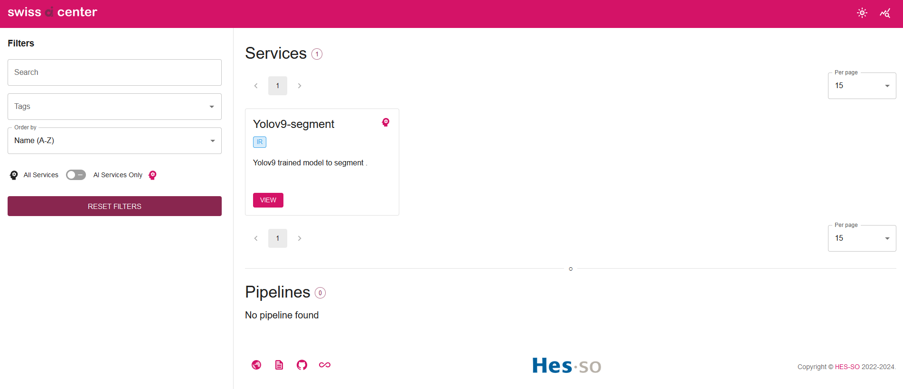
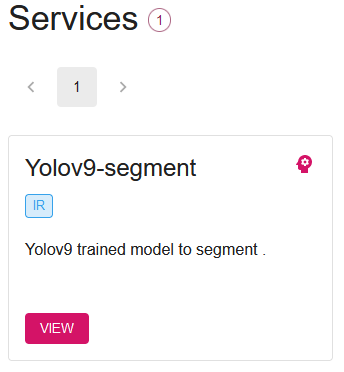
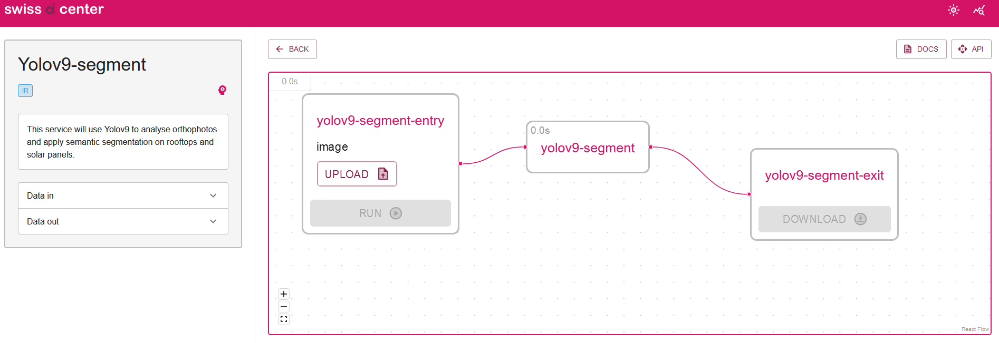
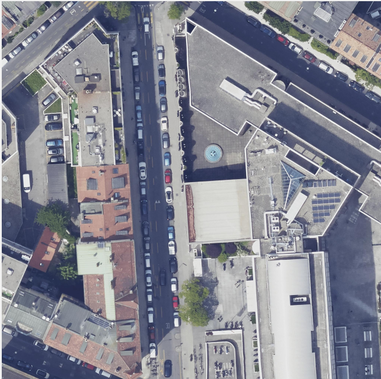
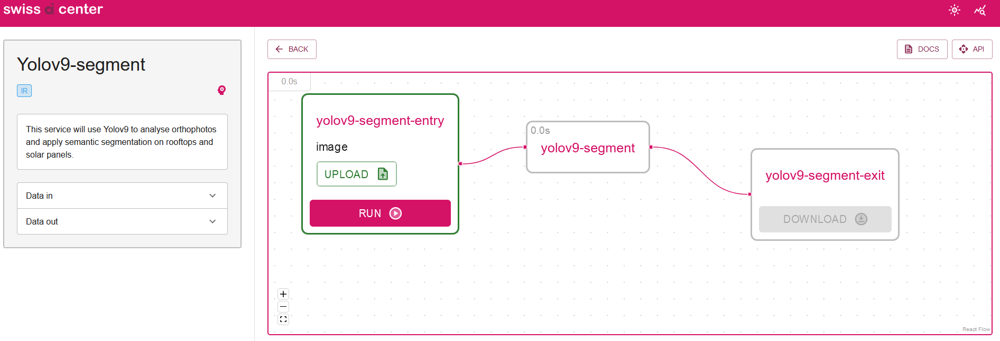
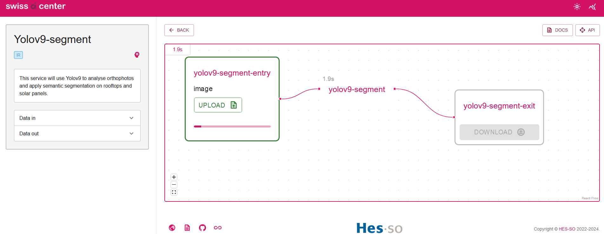
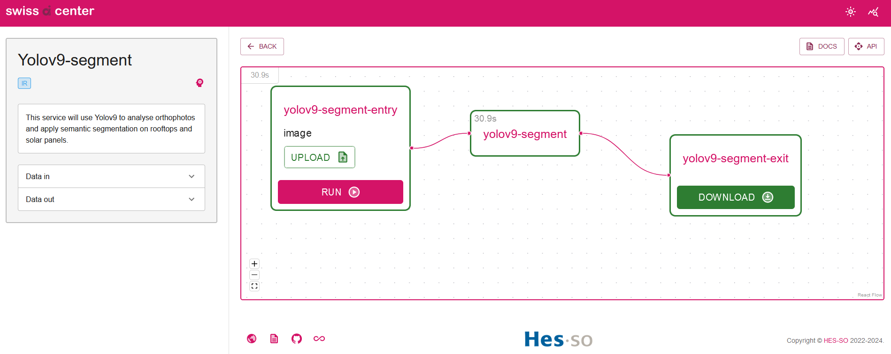
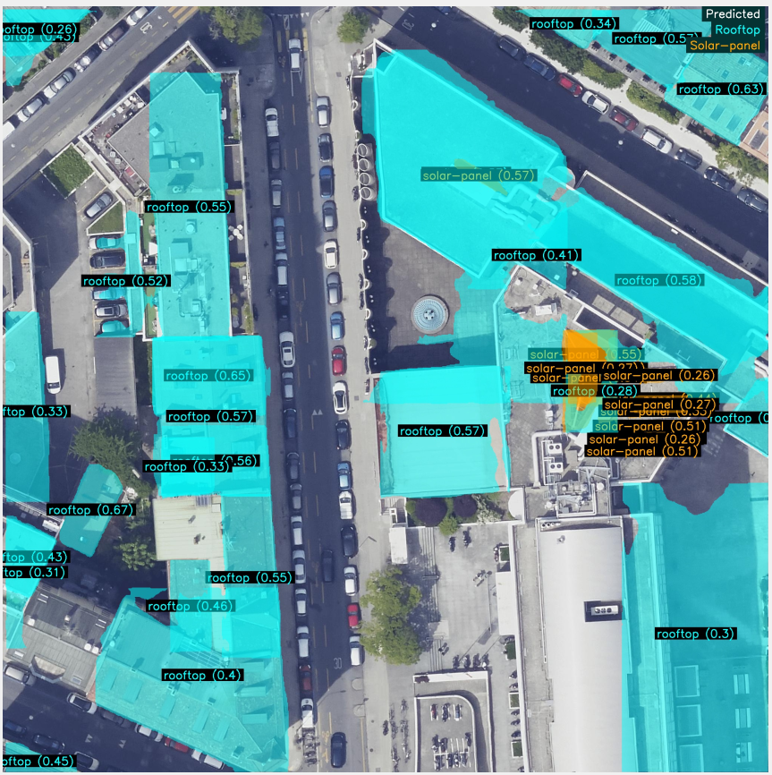

# yolov9-segment

This service will use a YOLOv9 model to apply semantic segmentation to an orthophoto image.

## Thanks

This service is based on <https://github.com/swiss-ai-center/yolov8-service> and Core-engine.

Documentation for the installation of the Core engine can be found [here](https://docs.swiss-ai-center.ch/tutorials/start-the-core-engine/).

Many thanks to the Swiss AI Center for providing the code.

## How to use the service to segment images from the test dataset

1) You need to have the Core engine installed before using this service.

    a) Clone the Core engine repository
    ```bash
    mkdir github
    cd github
    git clone https://github.com/swiss-ai-center/core-engine.git
    ```

    b) install the Core engine Backend with Docker Compose

    ```bash
    # Change directory to the Core engine Backend
    cd core-engine/backend

    # Build the Docker image
    docker compose build --no-cache --parallel

    # Start the Core engine Backend
    docker compose up
    ```

    c) in a new terminal install the Core engine Frontend with Docker Compose

    ```bash
    # Change directory to the Core engine Frontend ➜ github/core-engine/frontend
    cd ..
    cd frontend

    # Build the Docker image
    docker compose build --no-cache --parallel

    # Start the Core engine Frontend
    docker compose up
    ```

   Wait for the server to start

   

3) Install this service

    a) clone the repository

    ```bash
    # Return to the root folder ➜ github
    cd ..
    cd ..
    git clone https://github.com/denisiglesiasgarcia/yolov9-service
    ```

    b) add the [model](https://hessoit-my.sharepoint.com/:u:/g/personal/denis_iglesias_hes-so_ch/ESf0u57JrkREq10xx3Cn1mEBOPOnuOmKtKgb3J0dym5vkA?e=TZmxZB) to the service

    ```bash
    # Download the model
    https://hessoit-my.sharepoint.com/:u:/g/personal/denis_iglesias_hes-so_ch/ESf0u57JrkREq10xx3Cn1mEBOPOnuOmKtKgb3J0dym5vkA?e=TZmxZB
    
    # Create the model directory
    cd yolov9-service
    mkdir src/model

    # move the model to the model directory
    mv best.pt src/model
    ```

    c) Build and start the service

    ```bash
    # Build the Docker image
    docker compose build --no-cache --parallel

    # Start the service
    docker compose up
    ```

4) Download the [dataset](https://hessoit-my.sharepoint.com/:f:/g/personal/denis_iglesias_hes-so_ch/Ev3KpsdP38dPicLqPfpU4NsB-6_eaG-yV_SLDaP-6JnPtQ?e=cBAFLA)

5) Access the Core engine Frontend on <http://localhost:3000>

    

6) Go to "Launch the application"

    

7) Select the service

    

    

8) Upload a picture of the dataset test

    

    

9) Click on "Run"

    

10) Download the result

    

    
