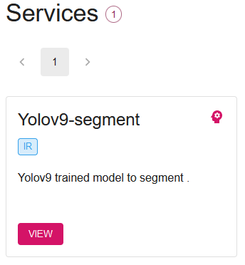
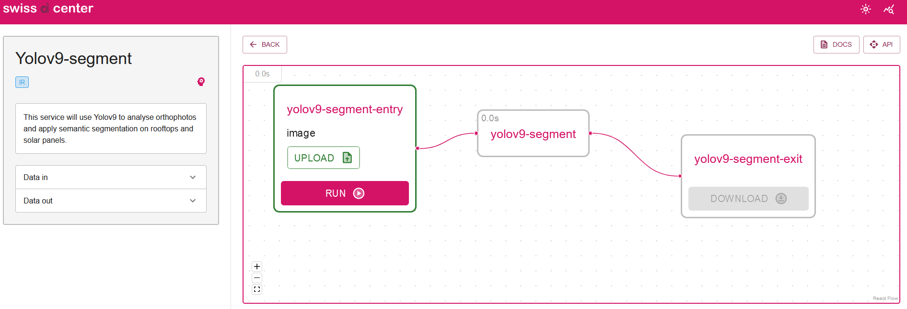

# yolov9-segment

This service will use a YOLOv9 model to apply semantic segmentation to an orthophoto image.

## Install

1) You need to have the Core engine installed before using this service.

    ```bash
    # Clone the Core engine repository
    git clone https://github.com/swiss-ai-center/core-engine.git
    ```

    Documentation for the installation of the Core engine can be found [here](https://docs.swiss-ai-center.ch/tutorials/start-the-core-engine/)

    a) install the Core engine Backend with Docker Compose

    ```bash
    # Change directory to the Core engine Backend
    cd core-engine/backend

    # Build the Docker image
    docker compose build

    # Start the Core engine Backend
    docker compose up
    ```

    b) install the Core engine Frontend with Docker Compose

    ```bash
    # Change directory to the Core engine Frontend
    cd ..
    cd core-engine/frontend

    # Build the Docker image
    docker compose build

    # Start the Core engine Frontend
    docker compose up
    ```

2) Install this service

    a) clone the repository

    ```bash
    # Clone this service repository
    git clone https://github.com/denisiglesiasgarcia/yolov8-service
    ```

    b) add the [model](https://hessoit-my.sharepoint.com/:u:/g/personal/denis_iglesias_hes-so_ch/ESf0u57JrkREq10xx3Cn1mEBOPOnuOmKtKgb3J0dym5vkA?e=TZmxZB) to the service

    ```bash
    # Download the model
    https://hessoit-my.sharepoint.com/:u:/g/personal/denis_iglesias_hes-so_ch/ESf0u57JrkREq10xx3Cn1mEBOPOnuOmKtKgb3J0dym5vkA?e=TZmxZB

    # make the model directory
    mkdir src/model

    # move the model to the model directory
    mv best.pt src/model
    ```

    c) Build and start the service

    ```bash
    # Build the Docker image
    docker compose build

    # Start the service
    docker compose up
    ```

3) Download the [dataset](https://hessoit-my.sharepoint.com/:f:/g/personal/denis_iglesias_hes-so_ch/Ev3KpsdP38dPicLqPfpU4NsB-6_eaG-yV_SLDaP-6JnPtQ?e=cBAFLA)

4) Access the Core engine Frontend on <http://localhost:3000>

    

5) Go to "Launch the application"

    

6) Select the service

    

    

7) Upload a picture of the dataset test

    

    

8) Click on "Run"

    

9) Download the result

    

    